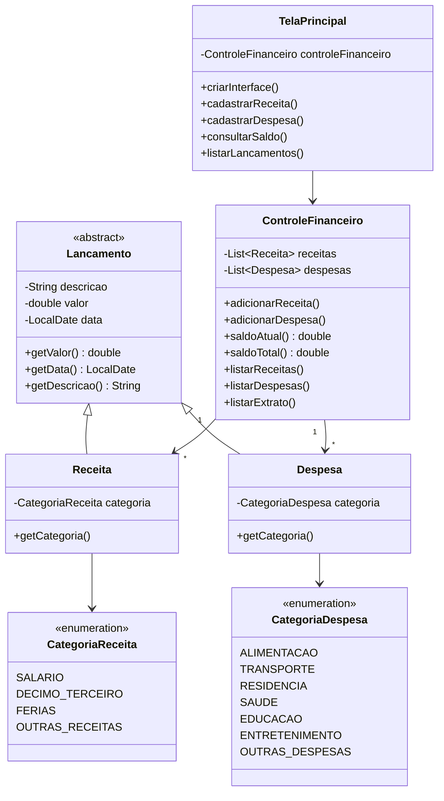

# Sistema de Controle Financeiro Doméstico

## Diagrama UML

```mermaid
classDiagram

class ControleFinanceiro {
    -List~Receita~ receitas
    -List~Despesa~ despesas
    +adicionarReceita()
    +adicionarDespesa()
    +saldoAtual() double
    +saldoTotal() double
    +listarReceitas()
    +listarDespesas()
    +listarExtrato()
}

class Lancamento {
    <<abstract>>
    -String descricao
    -double valor
    -LocalDate data
    +getValor() double
    +getData() LocalDate
    +getDescricao() String
}

class Receita {
    -CategoriaReceita categoria
    +getCategoria()
}

class Despesa {
    -CategoriaDespesa categoria
    +getCategoria()
}

class CategoriaReceita {
    <<enumeration>>
    SALARIO
    DECIMO_TERCEIRO
    FERIAS
    OUTRAS_RECEITAS
}

class CategoriaDespesa {
    <<enumeration>>
    ALIMENTACAO
    TRANSPORTE
    RESIDENCIA
    SAUDE
    EDUCACAO
    ENTRETENIMENTO
    OUTRAS_DESPESAS
}

class TelaPrincipal {
    -ControleFinanceiro controleFinanceiro
    +criarInterface()
    +cadastrarReceita()
    +cadastrarDespesa()
    +consultarSaldo()
    +listarLancamentos()
}

Lancamento <|-- Receita
Lancamento <|-- Despesa

ControleFinanceiro "1" --> "*" Receita
ControleFinanceiro "1" --> "*" Despesa

Receita --> CategoriaReceita
Despesa --> CategoriaDespesa

TelaPrincipal --> ControleFinanceiro
```
